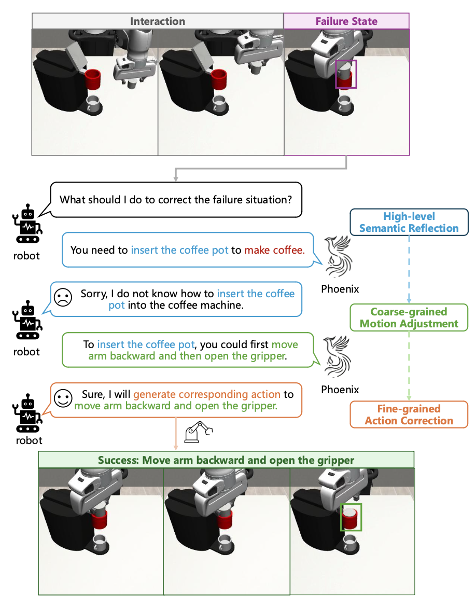
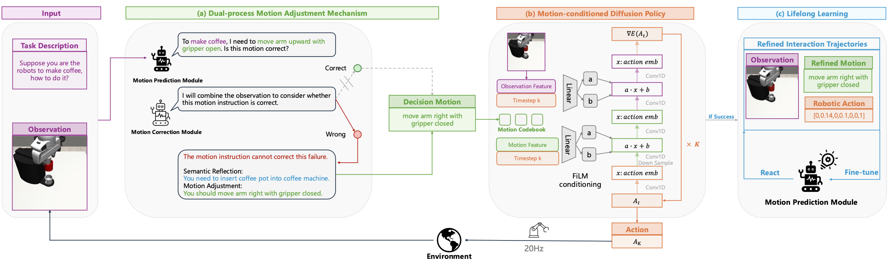
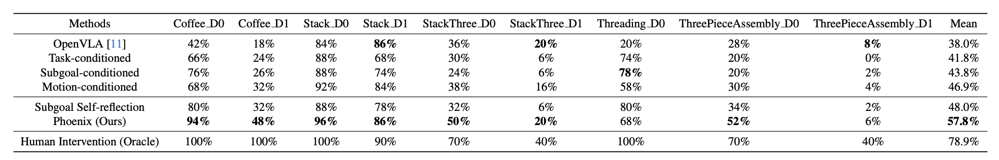

# Motion-based-Self-Reflection-Framework
[Project Page]() 

[Arxiv]()



## Overview
In this work, we propose a motion-based self-reflection framework for fine-grained robotic action correction, which leverages motion instruction as a bridge to connect high-level semantic reflection with low-level robotic action correction.

Concretely, we borrow the inferential capability of Multi-modal Large Language Models (MLLMs) for motion instruction correction, and propose a multi-task motion-conditioned diffusion policy for low-level robotic action correction.



The results prove the effectiveness of our method:




## Installation
First, install the simulation environment, please refer to the [mimicgen documentation](https://mimicgen.github.io/docs/introduction/installation.html) for more details:

### MimicGen Installation
```
mkdir deps
cd ${project_path}/deps
git clone https://github.com/NVlabs/mimicgen.git
cd mimicgen
pip install -e .
```
### Robosuite Installation
```
cd ${project_path}/deps
git clone https://github.com/ARISE-Initiative/robosuite.git
cd robosuite
git checkout b9d8d3de5e3dfd1724f4a0e6555246c460407daa
pip install -e .
```

### Robomimic Installation
```
cd ${project_path}/deps
git clone https://github.com/ARISE-Initiative/robomimic.git
cd robomimic
git checkout d0b37cf214bd24fb590d182edb6384333f67b661
pip install -e .
```
### Robosuite_task_zoo Installation
```
cd ${project_path}/deps
git clone https://github.com/ARISE-Initiative/robosuite-task-zoo
cd robosuite-task-zoo
git checkout 74eab7f88214c21ca1ae8617c2b2f8d19718a9ed
pip install -e .
```

### Llava Installation
please refer to the [Llava Documentation](https://github.com/haotian-liu/LLaVA):
```
cd ${project_path}/deps
git clone https://github.com/haotian-liu/LLaVA.git
cd LLaVA
pip install -e .
pip install -e ".[train]"
pip install flash-attn --no-build-isolation
```


## Usage

### Motion Instruction Generation

To train our motion prediction module, motion correction module, and the corresponding motion-conditioned diffusion policy, we need to annotate the trajectories with their corresponding motion instruction.

#### Dataset for Motion-conditioned Diffusion Policy 
1. Mimicgen Dataset Download
Here we utilize "Coffee_D0" task for example:
```
    cd ${project_path}/deps/mimicgen
    python mimicgen/scripts/download_datasets.py --dataset_type core --tasks coffee_d0
    mv coffee_d0 ${project_path}/diffusion_policy_for_action/train_dataset/origin_datasets
```

2. Motion Instruction Generation
```
    cd ${project_path}/deps/mimicgen/diffusion_policy_for_action/train_dataset
    python create_5hz_dataset_new_motion.py
```
This script will generate the motion information and save it in the adjust_llava_motion folder.

3. Data Format Conversion
```
    cd ${project_path}/diffusion_policy_for_action/train_dataset
    python create_speed_dataset.py
```

To improve model training efficiency and GPU utilization, we found that the original hdf5 format stores the entire trajectory as a single meta information, which causes redundant observation and action information to be read during __getitem__ calls. Therefore, we use timestamps as the meta information for storage. While this increases the dataset overhead, it effectively improves GPU utilization.

Specifically, we call create_speed_dataset.py to generate the data and save it in the speed_adjust_llava_motion folder.

#### Dataset for MLLMs
1. Generate the motion json file
```
    cd ${project_path}/diffusion_policy_for_action/train_dataset
    python generate_llava_json_dataset.py
```
This script will generate the motion json file and save it in the adjust_llava_motion folder.

2. Render the rgb images for llava
```
    cd ${project_path}/diffusion_policy_for_action/train_dataset
    python generate_render_llava_dataset.py
```


### Motion-conditioned Diffusion Policy
Based on the generated motion instruction, we could train the multi-task motion-conditioned diffusion policy:
```
    cd ${project_path}/diffusion_policy_for_action
    bash scripts/train_speed_dataset.sh
```

### Motion Prediction Module(MPM)
```
    cd ${project_path}/llava_for_motion_instruction
    bash scripts/finetune_motion_prediction_module.sh
```


### Motion Correction Module(MCM)
Utilizing the MPM and the motion-conditioned diffusion policy, we could borrow the common knowledge of MLLMs for low-level robotic action prediction. However, the MPM trained on success expert data often struggles to recover from these failure scenarios. Thus, we develop the motion correction module, to identify failure scenarios and correct behaviors from such situations.

#### Online Human Intervention 
To collect interaction data, we designed an online human intervention approach for gathering interaction correction data. Since it runs on the server side, we save images to enable interaction based on the visuals. If a local host is available, it can be adjusted for real-time rendering instead:
```
    cd ${project_path}/diffusion_policy_for_action
    bash scripts/collect_human_feedback.sh
```

#### 

#### Motion Correction Module Training

```
    cd ${project_path}/llava_for_motion_instruction
    bash scripts/finetune_motion_correction_module.sh
```

### Evaluation
To accelerate inference, we design a multi-environment inference script.

The inference script which only utilize MPM for motion instruction prediction:
```
    cd ${project_path}/diffusion_policy_for_action
    bash scripts/inference.sh
```

The inference script which utilize MCM for motion correction:
```
    cd ${project_path}/diffusion_policy_for_action
    bash scripts/inference_with_auto_feedback.sh
```


